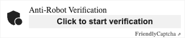
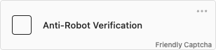

# Friendly Docs

**Note: This is the documentation website for Friendly Captcha v2, which is currently in beta.  
The documentation for v1 can be found [here](https://docs.friendlycaptcha.com) (or its source code [here](https://github.com/FriendlyCaptcha/friendly-challenge/tree/master/docs)).**

This is the source code of [Friendly Captcha](https://friendlycaptcha.com)'s [Developer Hub](https://developer.friendlycaptcha.com).

This website uses [Docusaurus 2](https://docusaurus.io/).

## Am I using V1 or V2
This repository is the documentation source for **v2** of the Friendly Captcha widget and API.

Below are screenshots to help you recognize the one you are using.

### V1 Widget Screenshot ([docs](https://docs.friendlycaptcha.com))


### V2 Widget Screenshot 



## Local Development
> Note: You don't have to run it locally to contribute. You can also edit the markdown files in the `docs` folder using your favorite text editor.


Make sure you have [Node](https://nodejs.org/en) installed.

```shell
# Install dependencies
npm install

# Run locally with live reload
npm run start
```

Now open your browser and point it at [http://localhost:3000](http://localhost:3000). When you edit a file and save it, it should be visible immediately.

## Building

```
$ npm run build
```

This command generates static content into the `build` directory and can be served using any static contents hosting service.
