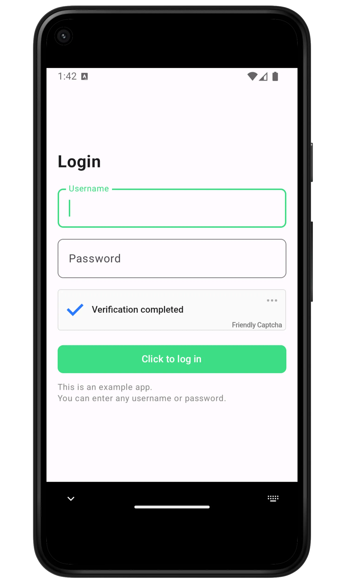

Friendly Captcha has been used to protect mobile apps since we started in 2020, but it required a custom integration each time.

We are happy to announce an official mobile SDK for Android and iOS. Using an SDK should reduce your integration time from days to under an hour.

*Screenshot of the Android example app.*

# Device Support

We care a lot about not excluding users, part of that is supporting the widest possible set of devices. We support devices and operating systems that are over 10 years old.

| **Platform** | **Supported Version** |
| --- | --- |
| Android | ≥ Android 4.1 (API level 16) |
| iOS | ≥ iOS 10 officially supported |
| iOS | ≥ iOS 8 on a best effort basis |

# Getting Started

### Android

The **[open source](https://github.com/FriendlyCaptcha/friendly-captcha-android) Android SDK** supports both **AndroidView** and **Jetpack Compose** UI frameworks, and it can be used from **Java** or **Kotlin**.

You can install the SDK from [Maven Central](https://central.sonatype.com/artifact/com.friendlycaptcha.android/friendly-captcha-android) ([installation instructions](https://github.com/FriendlyCaptcha/friendly-captcha-android?tab=readme-ov-file#installation)).

Full examples and a guide for integrating it into your app can be found [here](https://github.com/FriendlyCaptcha/friendly-captcha-android?tab=readme-ov-file#usage).

### iOS

The **[open source](https://github.com/FriendlyCaptcha/friendly-captcha-ios) iOS SDK** supports both **UIKit** and **SwiftUI** UI frameworks, and it can be used from **Swift** or **Objective C**.

You can install the SDK from [Cocoapods](https://cocoapods.org/pods/FriendlyCaptcha) or [Carthage](https://github.com/FriendlyCaptcha/friendly-captcha-ios?tab=readme-ov-file#carthage) ([installation instructions](https://github.com/FriendlyCaptcha/friendly-captcha-ios?tab=readme-ov-file#installation)).

Full examples and guide for integrating it into your app can be found [here](https://github.com/FriendlyCaptcha/friendly-captcha-ios?tab=readme-ov-file#usage).