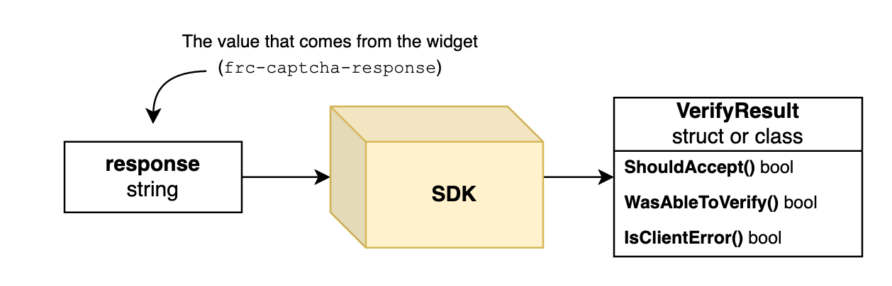

Developers add a captcha to their websites and apps to protect against abuse. Perhaps they include a captcha widget during signup to prevent spam accounts from being created. 

Usually the integration with a captcha provider involves a widget you add to your website. This widget inserts a value that you verify on your server. The value that is inserted is usually called the captcha “*response*”. I think a better name for the captcha *“response”* would be *“access token”*, but let’s use that common naming.

# The captcha bouncer

Let’s explore an analogy for a captcha you add to your website.

Imagine you are the owner of a club, and you only want to admit people who can dance well. Across the street there’s a dance school and they are happy to work together with you. You set up the following scheme: potential visitors first visit the school, take a dance test, and then receive a piece of paper with a code that proves they passed the dance test.

## The happy path

When a visitor shows up at your door, you take their piece of paper and call the dance school to verify that this code is valid. If the visitor fails the test, that’s still part of the happy path: you were able to verify their dancing skills.

That’s pretty much how captchas work on the web: visitors on your webpage pass a test and receive the response token. This token is sent to your server, where you verify that it’s valid by calling your captcha provider’s API. In a way the captcha provider vouches for the visitor having passed the test.

## The unhappy path

Let’s think about what can go wrong at the door of our club. A visitor could turn up without a piece of paper: that’s easy; you can reject those visitors.

But what if something else goes wrong? Maybe your telephone stops working, or the dance school doesn’t pick up the phone. What do you do?

You have two options in that moment:

1. You can ***fail open***: you allow everybody into your club.
2. You can ***fail closed**:* you send away everybody that shows up.

This is only an analogy. In the website bot protection version of this situation, it’s usually best to **fail open.** It’s better to potentially open yourself up to some bots getting through, rather than rejecting all users. In either case the reason of the failure should be logged and alerted on.

# How we design for failing open (or closed)

Most of our competitors fail to acknowledge the unhappy path. In their integration examples and SDKs verification success is presented in a binary way: *success* or *reject*. But there is a third case: the one in which you were unable to verify the captcha response.

Of course we aim for that to never happen by making our API as reliable as possible ([status page](https://status.friendlycaptcha.com/)) - but let’s design for the worst case: our data centers each get hit by a meteor.

What does your server code do? Fail closed, fail open, or worse: crash? This should be a conscious decision.

In designing our SDKs and examples we make sure it’s straightforward to handle all possible cases. Here’s a simplified diagram of the captcha verification flow in our SDKs, including the signature of the `VerifyCaptchaResponse` returned by our API.



And here’s an example that shows how you might implement that flow in PHP.

```php
function handleSignupRequest() {
    global $captchaSDK;

    $captchaResponse = isset($_POST["frc-captcha-response"]) ? $_POST["frc-captcha-response"] : null;
    $result = $captchaSDK->verifyCaptchaResponse($captchaResponse);

    if (!$result->wasAbleToVerify()) {
        if ($result->isClientError()) {
            // ALERT: your website is NOT PROTECTED because of a configuration error.
            // Send an alert to yourself, check your API key (and sitekey).
            error_log("Failed to verify captcha response because of a configuration problem: " . print_r($result->getResponseError()));
        } else {
            // Something else went wrong, maybe there is a connection problem or the API is down.
            error_log("Failed to verify captcha response: " . print_r($result->getErrorCode()));
        }
    }

    if (!$result->shouldAccept()) {
        // The captcha was not OK, show an error message to the user
        echo "Anti-robot captcha check failed, please try again.";
        return;
    }

    // The captcha is accepted, handle the request
    createAccount(...)
}
```

You can copy-paste our examples into your code and adapt them to what makes sense for your use-case. While handling the unhappy path doubles the length our examples, we recommend that anyone integrating with our API transparently handles all scenarios.

# First-party, tested SDKs

We aim to create SDKs for all popular programming languages to make a correct integration quick and easy. Our goal is not only to be the most privacy-friendly and accessible captcha, but also the one with the best developer experience.

To ensure that all our SDKs behave consistently and correctly in the face of failures, we developed an open-source [shared testing framework](https://github.com/FriendlyCaptcha/friendly-captcha-sdk-tooling/tree/main/friendly-captcha-sdk-testserver) that simulates error cases. We provide these same tools for outside contributors to create properly tested SDKs for languages/frameworks we don’t support (yet).

Outside of SDKs, we also provide plugins for popular CMS and E-commerce frameworks. These plugins are generally built upon our SDKs, so they inherit this same robustness.

Looking to integrate Friendly Captcha with your website or app? Check out our [integrations](https://developer.friendlycaptcha.com/integrations) page for an overview of SDKs and plugins.
