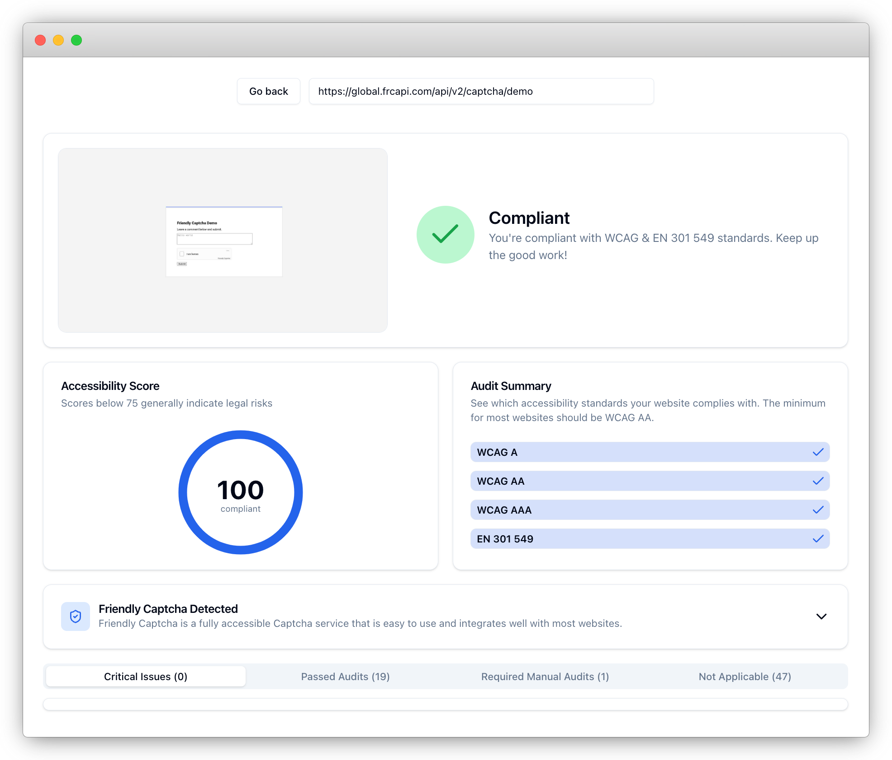

A couple of weeks ago, while browsing open support tickets, I noticed a customer report that the Friendly Captcha widget was not WCAG-compliant. In other words, something about the widget fell outside the set of recommendations provided by the Web Content Accessibility Guidelines.

Removing barriers to accessing the web is a primary value of Friendly Captcha, so it wouldn't do to have a product that was not as accessible as possible. As luck would have it, right around the time of this customer report, we launched an in-house [website accessibility checker](https://accessibilitycheck.friendlycaptcha.com/). It allows anyone to input a website URL and receive a report with an accessibility score and list of remediations to achieve compliancy with common accessibility standards.

I entered the URL of the Friendly Captcha demo. Sure enough, the report contained an issue: the `<iframe>` element that houses the Friendly Captcha widget was missing an accessible name. According to WCAG 2.0, all `<frame>` and `<iframe>` elements must have an accessible name, provided by the `title` attribute. The Friendly Captcha widget didn't have that attribute.

[One pull request later](https://github.com/FriendlyCaptcha/friendly-captcha-sdk/pull/40), the Friendly Captcha widget had a (properly localized) `title` attribute with a descriptive name. After redeploying the demo, I checked it again using the accessibility checker.

The positive feedback from a big green checkmark never fails. If you're looking for a user-friendly and accessible captcha solution, consider trying [Friendly Captcha](https://friendlycaptcha.com/). Or, if you'd like to see how your websites stacks up in terms of accessibility, try entering its URL in the [accessibility checker](https://accessibilitycheck.friendlycaptcha.com/)!
