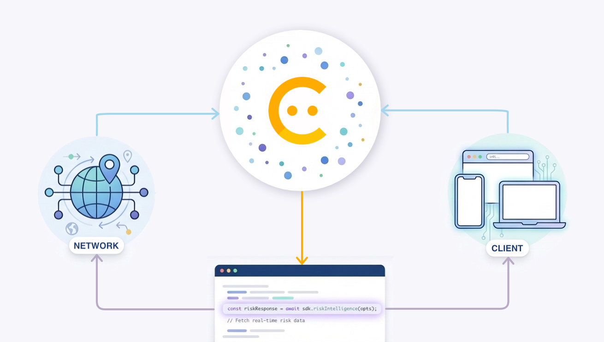

Today we're announcing the general availability of [**Risk Intelligence**](https://developer.friendlycaptcha.com/docs/v2/risk-intelligence/), a new product that provides information about visitors to your websites to help you make data-driven decisions about how to secure them.

At Friendly Captcha we assess the risk of traffic to your websites and apps by gathering signals about the

- **Network:** Where are they connecting from?
- **Client:** What are they using to connect?
- **Behavior:** What are their usage patterns?

We use this information for our Captcha product to determine how the difficulty of the Captcha challenge.

With Risk Intelligence, we are sharing this risk data with you so you can use it to make decisions, use it in existing fraud-prevention systems and enrich existing events. For example, based on the suspiciousness of a visitor you can require additional authentication steps to prevent account takeover.

## How does it work?

Risk Intelligence uses the same front-end SDK you are already using for your Captcha integration. You can now call `sdk.riskIntelligence()`, which gives you a Risk Intelligence token. Your back-end server then can send this token to the Friendly Captcha API to receive the Risk Intelligence data.

## Getting started

**Risk Intelligence** is now available _automatically_ for all customers on **Advanced** and **Enterprise** plans. Read more about [use cases for Risk Intelligence](https://developer.friendlycaptcha.com/docs/v2/risk-intelligence/use-cases), or follow our guide to learn [how to get started](https://developer.friendlycaptcha.com/docs/v2/risk-intelligence/getting-started/).
