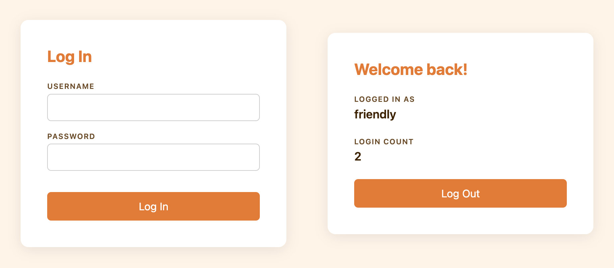
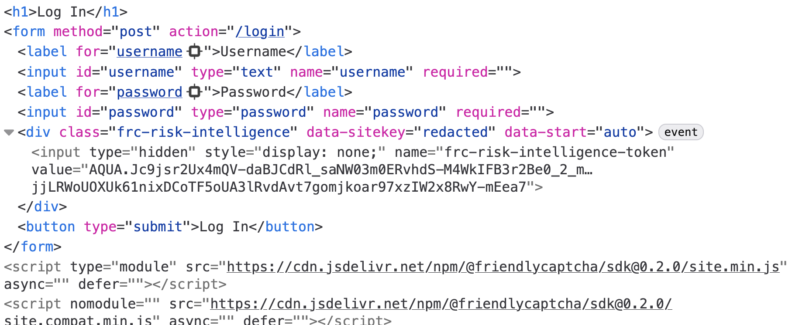
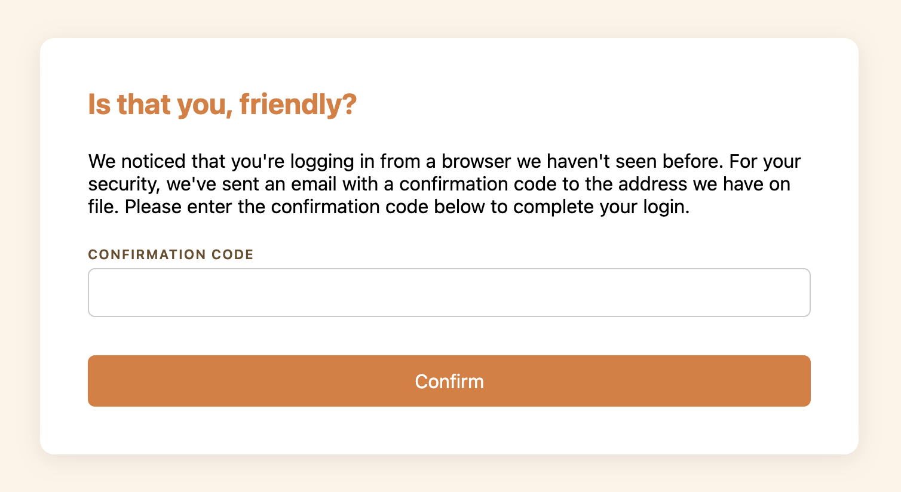

# Risk-Based Authentication using Risk Intelligence

This guide shows how to build a simple **risk-based authentication** flow using [**Risk Intelligence**](../../risk-intelligence/). Risk-based authentication means using signals from the browsing session to make logging in more difficult (or easier) depending on the perceived risk level. In this particular example, we will use Risk Intelligence data to require an additional confirmation when the user is logging in from an unrecognized browser.

We’ll be starting from a basic [Express](https://expressjs.com/) app running on Node.js. This app renders a login form (which accepts any credentials) and then displays a minimal welcome page showing the number of times a given username has logged in.



If you want to follow along, you can check out the code from the [repository](https://github.com/FriendlyCaptcha/risk-intelligence-tutorial-node-express). The [starting code](https://github.com/FriendlyCaptcha/risk-intelligence-tutorial-node-express/tree/init) is available on the branch named `init`.

:::warning Not production-ready

This is a sample app built for showing how to use Risk Intelligence. It skips best practices in the interest of simplicity, so it should not be used as a starting point for a production project.

:::

To use Risk Intelligence, we need a Friendly Captcha sitekey and an API key. Instructions for creating those are available in the [**Getting Started**](../../risk-intelligence/getting-started/setup.md) guide.

## Generating the Risk Intelligence token

With our sitekey in hand, we are ready to [generate a Risk Intelligence token](../../risk-intelligence/getting-started/generate.md). All we need to do is add 3 lines of code to the login form. This project uses the Pug templating engine, but of course this works with plain HTML too.

```diff
 extends layout

 block content
   h1 Log In
   form(method="post" action="/login")
     label(for="username") Username
     input(type="text" id="username" name="username" required)
     label(for="password") Password
     input(type="password" id="password" name="password" required)
+    div.frc-risk-intelligence(data-sitekey=process.env.FRC_SITEKEY)
     button(type="submit") Log In
+  script(type="module" src="https://cdn.jsdelivr.net/npm/@friendlycaptcha/sdk@0.2.0/site.min.js" async defer)
+  script(nomodule src="https://cdn.jsdelivr.net/npm/@friendlycaptcha/sdk@0.2.0/site.compat.min.js" async defer)
```

<details>

<summary>
**Self-hosting the front-end SDK scripts**
</summary>

Using `cdn.jsdelivr.net` is optional. If preferred, you can self-host the scripts. [Download the latest release files](https://cdn.jsdelivr.net/npm/@friendlycaptcha/sdk@0.2.0) and serve them from your own server. Remember to update these scripts regularly.

`cdn.jsdelivr.net` is blocked in some jurisdictions, like some parts of China. If your website needs to be reachable from these jurisdictions, we recommend that you self-host the scripts.

</details>

If you restart the server and refresh the page, then focus either of the text fields, a Risk Intelligence token will be generated. If you inspect the `<form>` in your browser’s developer tools, you’ll be able to find a hidden `<input>` element with the token as its `value`.



### Prevent submitting the form without the token

With our current implementation, a web user with a high network latency could theoretically enter their email and submit the form before the token has been generated. With a few changes, we can make the implementation a little more robust.

1. Start with the submit button `disabled`.
2. Generate the risk intelligence token immediately, rather than when the form is focused.
3. When token generation finishes, enable the button.

All we need to do is add a `disabled` attribute to the button, a `data-start="auto"` attribute to the `<div>`, and a few lines of JavaScript. Here’s the final version of the login page markup:

```diff
 extends layout

 block content
   h1 Log In
   form(method="post" action="/login")
     label(for="username") Username
     input(type="text" id="username" name="username" required)
     label(for="password") Password
     input(type="password" id="password" name="password" required)
-    div.frc-risk-intelligence(data-sitekey=process.env.FRC_SITEKEY)
+    div.frc-risk-intelligence(data-sitekey=process.env.FRC_SITEKEY data-start="auto")
-    button(type="submit") Log In
+    button(type="submit" disabled) Log In
   script(type="module" src="https://cdn.jsdelivr.net/npm/@friendlycaptcha/sdk@0.2.0/site.min.js" async defer)
   script(nomodule src="https://cdn.jsdelivr.net/npm/@friendlycaptcha/sdk@0.2.0/site.compat.min.js" async defer)
+  script.
+    document.addEventListener("DOMContentLoaded", () => {
+      const el = document.querySelector(".frc-risk-intelligence");
+      const btn = document.querySelector('button[type="submit"]');
+      el.addEventListener("frc:riskintelligence.complete", () => {
+        btn.disabled = false;
+      });
+      el.addEventListener("frc:riskintelligence.error", (e) => {
+        console.warn("Risk Intelligence token generation errored", e.detail);
+        btn.disabled = false;
+      });
+    });
```

If you refresh the page, the token will be generated automatically before the form is focused.

## Retrieving the Risk Intelligence data

When the form is submitted, our server-side handler receives a POST request with the username and a Risk Intelligence token. We need to pass that token to the Friendly Captcha API to retrieve the Risk Intelligence data, which will include the browser information.

To communicate with the Friendly Captcha API, we’ll use the `@friendlycaptcha/server-sdk` library, which we can install from NPM:

```shell
npm install @friendlycaptcha/server-sdk
```

With that installed, we can instantiate a `FriendlyCaptchaClient` that we’ll use to retrieve Risk Intelligence data using the token:

```diff
 import express from "express";
 import session from "express-session";
+import { FriendlyCaptchaClient } from "@friendlycaptcha/server-sdk";
 import * as store from "./store.js";
 
 const app = express();
 const port = process.env.PORT || 3000;
 
+const frcClient = new FriendlyCaptchaClient({
+  apiKey: process.env.FRC_APIKEY,
+  sitekey: process.env.FRC_SITEKEY,
+});
+
```

Next we can update the `POST /login` handler to extract the Risk Intelligence token from the form:

```diff
 app.post(
   "/login",
   express.urlencoded({ extended: false }),
   async (req, res) => {
     req.session.user = authenticate(req.body.username);
+    const browser = await getBrowser(req.body["frc-risk-intelligence-token"]);
+    console.log(`User ${req.session.user.name} logged in from ${browser || "an unknown browser"}`);
     req.session.save(() => res.redirect("/"));
   },
 );
```

We’re now calling a `getBrowser` function to discover the browser used and then logging a message. `getBrowser` encapsulates the Friendly Captcha API call, and the implementation is copied from [the project README](https://github.com/FriendlyCaptcha/friendly-captcha-javascript/?tab=readme-ov-file#retrieving-risk-intelligence) with some minor modifications. Here it is in its entirety:

```js
async function getBrowser(token) {
  if (!token) {
    return console.warn(
      "Empty token, skipping Risk Intelligence data retrieval.",
    );
  }

  const result = await frcClient.retrieveRiskIntelligence(token);

  // Check if we were able to retrieve the risk intelligence data
  if (result.wasAbleToRetrieve()) {
    // Check if the token is valid and data was retrieved successfully
    if (result.isValid()) {
      const response = result.getResponse();
      const { browser } = response.data.risk_intelligence.client;
      return `${browser.name}, version ${browser.version}`;
    } else {
      // Token was invalid or expired
      const error = result.getResponseError();
      console.log("Error:", error?.error_code, error?.detail);
    }
  } else {
    // Network issue or configuration problem
    if (result.isClientError()) {
      console.log("Configuration error - check your API key");
    } else {
      console.log("Network issue or service temporarily unavailable");
    }
  }
}
```

Try restarting the server and logging in from a multiple browsers. Here are my server logs:

```
Server listening on port 3000
User friendly logged in from Firefox, version 148
User friendly logged in from Safari, version 17.6
User friendly logged in from Chrome, version 145
```

<details>

<summary>
**Without a back-end SDK**
</summary>

The implementation above uses the `@friendlycaptcha/server-sdk` library, but you can also send a plain HTTP request. That might look something like this:

```js
async function getBrowser(token) {
  try {
    const response = await fetch("https://global.frcapi.com/api/v2/riskIntelligence/retrieve", {
      method: "POST",
      headers: {
        "Content-Type": "application/json",
        "X-API-Key": process.env.FRC_APIKEY,
      },
      body: JSON.stringify({ token }),
    });
    const body = await response.text();
    const parsed = JSON.parse(body);
    if (parsed.error) {
      throw parsed.error;
    } else if (!response.ok) {
      throw body;
    }
    const { name, version } = parsed.data.risk_intelligence.client.browser;
    return `${name}, version ${version}`;
  } catch (error) {
    console.warn("Failed to retrieve Risk Intelligence data", error);
  }
}
```

</details>

## Risk-based authentication

Now that we have the browser information, we can keep track of which browsers we’ve seen for a given user, and perform some special logic if they attempt to log in from a browser we haven’t seen yet. There are a couple of changes we need to make. Let’s start by updating the user model.

```diff
@@ -7,6 +7,7 @@ export function authenticate(username) {
     user = {
       name: username,
       loginCount: 0,
+      browsers: new Set(),
     };
     users.set(username, user);
   }
@@ -17,7 +18,18 @@ export function getUser(username) {
   return users.get(username);
 }
 
-export function recordLogin(username) {
+export function recordLogin(username, browser) {
   const user = getUser(username);
   user.loginCount++;
+  user.browsers.add(browser);
+}
+
+export function shouldConfirm(username, browser) {
+  const user = getUser(username);
+
+  // There needs to be at least 1 recognized browser
+  // for there to be an unrecognized browser.
+  if (user.browsers.size < 1) return false;
+
+  return !user.browsers.has(browser);
 }
```

Users now have a `Set` to keep track of the browsers they’ve used; when we record a visit from a user, we update the set, and there’s a new function to check if the user needs to confirm the login. Since our risk-based authentication is based on the user logging in from an unrecognized browser, `shouldConfirm` returns true if the current browser is not in the list of previously used browsers.

We also need to update the logic in our app’s routes to support the confirmation flow. Let’s start with the `POST /login` handler.

```diff
 app.post(
   express.urlencoded({ extended: false }),
   async (req, res) => {
     const user = store.authenticate(req.body.username);
-    store.recordLogin(user.name);
const browser = await getBrowser(req.body["frc-risk-intelligence-token"]);
-    console.log(
-      User ${user.name} logged in from ${browser || "an unknown browser"},
-    );
+
+    let nextRoute;
+    if (store.shouldConfirm(user.name, browser)) {
+      // Here you might generate a confirmation code and email it to the user's account,
+      // but we're going to skip it as part of this tutorial for the sake of simplicity.
+      nextRoute = "/confirm";
+      // Store the browser in the session so we can use it in the POST /confirm route.
+      req.session.browser = browser;
+    } else {
+      nextRoute = "/";
+      store.recordLogin(user.name, browser);
+    }
+
req.session.username = user.name;
-    req.session.save(() => res.redirect("/"));
+    req.session.save(() => res.redirect(nextRoute));
},
);
```

We’re going to use the new `store.shouldConfirm()` function to branch on whether the user’s browser is recognized or not.

If it’s not recognized, we’re redirecting to a new `/confirm` page and storing the browser in the session object (we’ll need it in another handler soon). As mentioned in the comment, a more realistic implementation would generate a confirmation code and email it to the user.

If the browser _is_ recognized, we record the new login and redirect to the index page.

There’s a new `GET /confirm` route that renders the confirmation page. Here’s the tiny handler:

```js
app.get("/confirm", (req, res) => {
  if (!req.session.username) return res.redirect("/login");

  res.render("confirm", {
    title: "Confirm Login",
    username: req.session.username,
  });
});
```

And the template, saved to `views/confirm.pug`:

```
extends layout

block content
  h1 Is that you, #{username}?
  p(style="width: 60ch") We noticed that you're logging in from a browser we haven't seen before. For your security, we've sent an email with a confirmation code to the address we have on file. Please enter the confirmation code below to complete your login.
  form(method="post" action="/confirm")
    label(for="confirmation") Confirmation Code
    input(type="text" id="confirmation" name="confirmation" required)
    button(type="submit") Confirm
```

This is what the page looks like in the browser:



Like the login page, this form accepts any input. Here’s the `POST /confirm` handler that process this form submission:

```js
app.post("/confirm", express.urlencoded({ extended: false }), (req, res) => {
  // The confirmation code is available in req.body.confirmation.
  // You would compare it to the one you generated in the POST /login handler.
  store.recordLogin(req.session.username, req.session.browser);
  res.redirect("/");
});
```

Upon successful confirmation, we record the login and redirect to the index page. We use the browser that we stored in the session in the `POST /login` handler.

With a risk-based authentication flow like this one, your login flow will be more robust against account takeover. There will be no additional friction for users authenticating from their usual browsers. In the event of a credential leak, an attacker would need to match the compromised user’s browser.

You can extend this check to [any of the other fields offered by Risk Intelligence](../../risk-intelligence/format.md). For example, you might require a confirmation if a user is logging in from a new country or network. To learn more, check out the [**Risk Intelligence**](../../risk-intelligence/) docs or read through the [**Getting Started**](../../risk-intelligence/getting-started/) guide.
