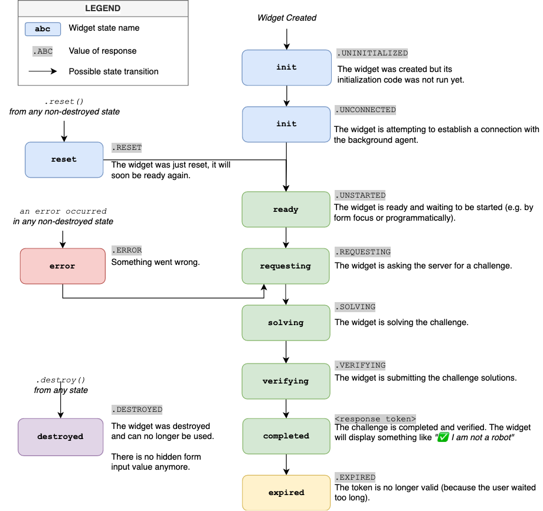

# Lifecycle

The widget has a fixed set of states it can be in.

Usually the only states you have to care about are the following:
* `completed`: the captcha has been completed, you can enable the button to submit and verification should pass.
* `error`: something went wrong. You should disable the submit button.
* `expired`: the user waited too long and needs to restart. You should disable the submit button.
* `destroyed`: You called `destroy()` on the widget which cleans it up entirely, it can no longer be used.

Below is a diagram of the entire flow.

## Lifecycle Diagram

